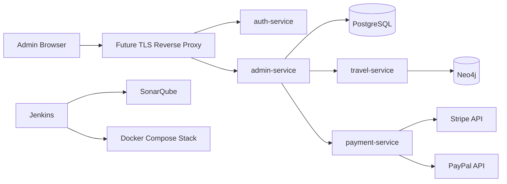

# Architecture

The project is organized as a microservices monorepo. Each service owns a bounded operational area and can be built into an independent Docker image.

## Services

- `auth-service`: authentication and authorization boundary for the admin dashboard.
- `admin-service`: future admin CRUD orchestration for users, travels, and payment methods.
- `travel-service`: future travel and destination management.
- `payment-service`: payment provider boundary prepared for Stripe and PayPal.

## Data Stores

- PostgreSQL stores relational administration data such as users, payment methods, and transactional records.
- Neo4j stores graph-oriented travel relationships such as destinations, activities, routes, and recommendations.

## Infrastructure

- `infra/docker/docker-compose.yml` provisions local infrastructure, databases, CI services, and app replicas.
- `infra/ansible` provides repeatable host setup and Docker Compose deployment.
- `Jenkinsfile` defines build, test, SonarQube analysis, and Docker image build stages.

## Request Tracing

Services accept `X-Correlation-Id` on incoming requests. If absent, the service generates one and returns it in the response. The value is added to the logging MDC under `correlationId`, allowing related logs to be searched across services.
