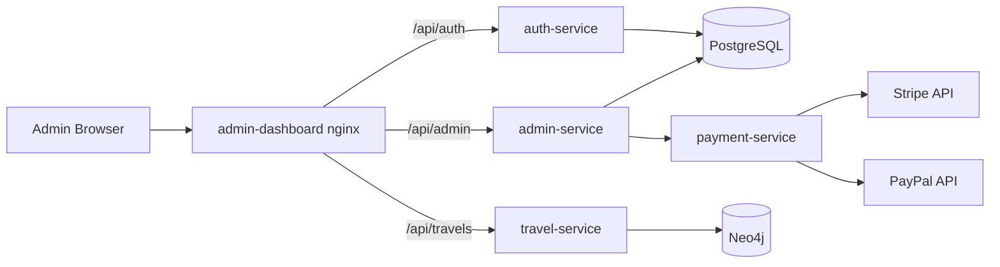

# CI/CD, Architecture & Tooling

End-to-end overview of how the Travel Management System is structured, built,
tested, and deployed. For the request-flow diagram see
[architecture.md](architecture.md); for the security baseline see
[security.md](security.md).

## 1. Application Architecture

Microservices monorepo built on **Java 21 / Spring Boot 3**, fronted by a React
SPA. Each service owns a bounded operational area and ships as an independent
Docker image.

### Services

| Service           | Responsibility                                             | Port | Store      |
| ----------------- | ---------------------------------------------------------- | ---- | ---------- |
| `auth-service`    | AuthN/AuthZ boundary; issues HS256 JWTs                     | 8081 | PostgreSQL |
| `admin-service`   | CRUD for users, payment methods, read-only bookings        | 8082 | PostgreSQL |
| `travel-service`  | CRUD for travels + Neo4j graph (destinations, activities…) | 8083 | Neo4j      |
| `payment-service` | Payment provider boundary for Stripe and PayPal            | 8084 | PostgreSQL |
| `admin-dashboard` | React + Vite SPA served by nginx, talks via `/api/*`        | 80/443 | —        |

### Frontend

React + Vite + TypeScript + Tailwind CSS.

- **Dev** (`npm run dev`): Vite dev server on `http://localhost:5173`, proxying
  `/api/auth`, `/api/admin`, `/api/travels` to `localhost:8081/8082/8083`.
  Override targets with `VITE_AUTH_URL`, `VITE_ADMIN_URL`, `VITE_TRAVEL_URL`.
- **Prod**: built into an nginx image, exposed on `5173→80` and `5443→443`
  (self-signed TLS in dev; HTTP redirects 301 to HTTPS).

### Data Stores

- **PostgreSQL 16** — relational admin data: users, payment methods,
  transactional records.
- **Neo4j 5 (community)** — graph data: destinations, routes, activities,
  recommendations.

### Request Tracing

Each request carries an `X-Correlation-Id` (generated if absent, echoed in the
response). The value is pushed into the logging MDC under `correlationId`,
enabling related logs to be searched across services.

## 2. CI/CD Pipeline

CI runs on two complementary layers:

- **GitHub Actions** ([`.github/workflows/ci.yml`](../.github/workflows/ci.yml))
  is the pull-request gate: on every PR to `develop`/`main` (and on pushes to
  those branches) it runs `mvn -B clean verify` on JDK 21, so no change merges
  without its unit + integration tests going green. Testcontainers works out of
  the box on the Ubuntu runner.
- **Jenkins** (root [`Jenkinsfile`](../Jenkinsfile)) owns the heavier pipeline:
  it re-runs the tests, performs the SonarQube analysis, and builds the Docker
  images.

### Jenkins pipeline

It runs inside a Maven container (`maven:3.9.9-eclipse-temurin-21`) with the
Docker socket mounted, so Testcontainers and image builds work
(Docker-in-Docker).

| Stage                    | Command                                          | Notes                                                            |
| ------------------------ | ------------------------------------------------ | ---------------------------------------------------------------- |
| **Checkout**             | `checkout scm`                                    | —                                                                |
| **Unit Tests**           | `mvn -B clean test`                               | Persistent `.m2` cache via `maven_repository` volume             |
| **SonarQube Analysis**   | `mvn -B verify sonar:sonar`                       | Uses `SONAR_HOST_URL` + `SONAR_TOKEN` (Jenkins credentials)      |
| **Quality Gate**         | polls `api/ce/task` + `api/qualitygates/project_status` | **Fails the build if the SonarQube Quality Gate is not `OK`.** Polls the API using the analysis `ceTaskId` — no plugin or webhook required |
| **Build Docker Images**  | `docker compose … build`                          | Builds the full stack from `infra/docker/docker-compose.yml`     |

- **Post**: always publishes JUnit reports (`**/target/surefire-reports/*.xml`).
- **Options**: `timestamps()`, `disableConcurrentBuilds()`.
- **Testcontainers**: `TESTCONTAINERS_RYUK_DISABLED=true` and
  `TESTCONTAINERS_CHECKS_DISABLE=true` are set for the in-container runs.

Jenkins itself is containerized ([`infra/jenkins/Dockerfile`](../infra/jenkins/Dockerfile),
exposed on `:8080` / `:50000`) with the Docker CLI + Compose plugin. It requires
two credentials:

- `sonar-host-url` — e.g. `http://sonarqube:9000`
- `sonar-token` — generated from SonarQube

## 3. Deployment (Ansible)

Repeatable host provisioning and stack deployment live in
[`infra/ansible/`](../infra/ansible/README.md).

| Playbook            | Purpose                                                                                 |
| ------------------- | --------------------------------------------------------------------------------------- |
| `setup-host.yml`    | Provisions target hosts (Docker, prerequisites)                                         |
| `deploy.yml`        | rsync project → ensure `.env` → `docker compose pull` + `build` + `up` (idempotent)     |

`deploy.yml` uses `community.docker.docker_compose_v2` to pull base images, build
service images, and bring the stack up with `remove_orphans`.

## 4. Secrets Management (Vault)

**HashiCorp Vault 1.18** (dev mode) holds every service secret.

- Each Spring service is built with the Maven `vault` profile and reads
  `secret/data/travelplan/<service>` at boot.
- The `vault-init` container seeds `secret/travelplan/*` from the `.env`
  (DB credentials, JWT secret, Stripe/PayPal keys, admin bootstrap) before the
  services start (`depends_on: vault-init: service_completed_successfully`).
- Vault UI/API on `http://localhost:8200` (root token from `VAULT_ROOT_TOKEN`).

## 5. Observability (Loki + Promtail + Grafana)

Centralized JSON logging with cross-service tracing.

- **Promtail** tails container logs from `/var/lib/docker/containers`.
- **Loki 3.3** stores them.
- **Grafana 11.4** on `http://localhost:5440` (login `admin/admin`) exposes the
  *TravelPlan logs* dashboard with a `correlationId` filter.

## 6. Docker Compose Topology

Local provisioning and reproducible infra:
[`infra/docker/docker-compose.yml`](../infra/docker/docker-compose.yml).

**Network segmentation** (4 bridges):

| Network                 | Members                                                    | Notes                          |
| ----------------------- | ---------------------------------------------------------- | ------------------------------ |
| `travel-internal`       | Services, PostgreSQL, Neo4j, Vault                          | `internal: true` (no egress)   |
| `travel-edge`           | Dashboard, PostgreSQL, Neo4j, payment-service, Vault       | External exposure              |
| `travel-ci`             | Jenkins, SonarQube (+ its DB)                              | CI plane                       |
| `travel-observability`  | Loki, Promtail, Grafana                                     | Logging plane                  |

**Resilience**: each microservice runs with `replicas: 2`, an
`actuator/health` healthcheck, and starts only after `postgres`/`neo4j` are
healthy and `vault-init` has completed.

**Load balancing**: the dashboard's nginx routes `/api/*` to the services using
Docker's embedded DNS (`resolver 127.0.0.11`) and a variable `proxy_pass`, so it
re-resolves service names at runtime and spreads requests round-robin across all
replicas — instead of pinning to a single IP resolved once at startup.
`proxy_next_upstream` retries the next replica when one returns an error/timeout.

### Local Endpoints

| URL                       | Component                          |
| ------------------------- | ---------------------------------- |
| `https://localhost:5443`  | Admin dashboard (TLS)              |
| `http://localhost:5173`   | Admin dashboard (301 → HTTPS)      |
| `http://localhost:5440`   | Grafana (`admin/admin`)            |
| `http://localhost:8200`   | Vault UI / API                     |
| `http://localhost:9000`   | SonarQube                          |
| `http://localhost:8080`   | Jenkins                            |
| `http://localhost:7474`   | Neo4j Browser                      |

## 7. Tooling Summary

| Domain          | Tools                                                             |
| --------------- | ---------------------------------------------------------------- |
| Backend         | Java 21, Spring Boot 3, Maven (`vault` profile)                  |
| Frontend        | React, Vite, TypeScript, Tailwind CSS, nginx                    |
| Databases       | PostgreSQL 16, Neo4j 5 (community)                              |
| Secrets         | HashiCorp Vault 1.18 (dev mode)                                 |
| Observability   | Loki 3.3, Promtail, Grafana 11.4                               |
| CI/CD           | Jenkins, SonarQube 10 (community)                              |
| Provisioning    | Docker Compose (local), Ansible (remote hosts)                 |
| Payments        | Stripe, PayPal (sandbox)                                        |

## 8. Git Workflow

- `main` — stable branch.
- `develop` — integrates validated work.
- `feat/...` — feature branches.
- Commits signed with `git commit -S`; PRs reviewed before merging into
  `develop`, then promoted to `main` when stable.

## 9. Dev-only Defaults to Harden

The stack is calibrated for local development. Before any real exposure:

- Vault runs in **dev mode** with a static root token — switch to a sealed,
  persistent Vault.
- Default passwords (`change_me_*`, Grafana `admin/admin`, admin bootstrap
  `ChangeMe123!`) must be rotated.
- TLS certificates are self-signed — replace with real certs.

See [security.md](security.md) for the full baseline.
