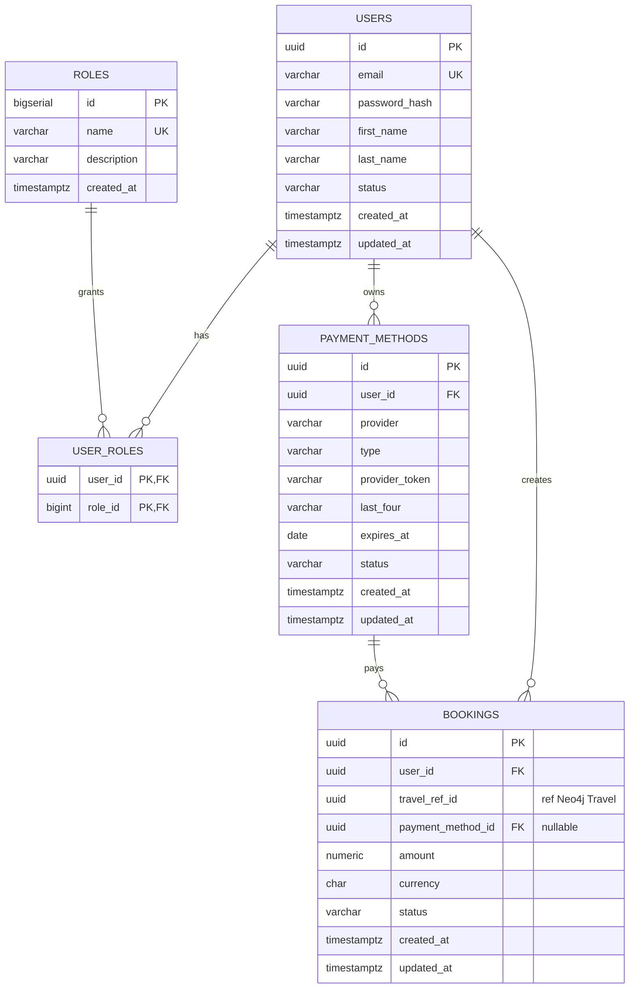

# Schéma de base de données

Le projet répartit ses données entre **PostgreSQL** (admin-service, données transactionnelles) et **Neo4j** (travel-service, graphe d'offres de voyage). Une référence applicative (`booking.travel_ref_id`) relie les deux sans contrainte cross-store.

## PostgreSQL (admin-service)

Migrations gérées par Flyway dans `services/admin-service/src/main/resources/db/migration/`.

### Diagramme



### Règles de cascading

| Relation | ON DELETE |
|---|---|
| `users → user_roles` | CASCADE |
| `roles → user_roles` | CASCADE |
| `users → payment_methods` | CASCADE |
| `users → bookings` | CASCADE |
| `payment_methods → bookings` | SET NULL (préserve l'historique) |

### Énumérations contraintes par CHECK

- `users.status` : `ACTIVE`, `SUSPENDED`, `DELETED`
- `payment_methods.provider` : `STRIPE`, `PAYPAL`
- `payment_methods.type` : `CARD`, `BANK_ACCOUNT`, `WALLET`
- `payment_methods.status` : `ACTIVE`, `EXPIRED`, `REVOKED`
- `bookings.status` : `PENDING`, `CONFIRMED`, `CANCELLED`, `COMPLETED`, `REFUNDED`

### Rôles seedés

`ADMIN`, `MANAGER`, `VIEWER`, `USER` (insérés par V1).

## Neo4j (travel-service)

Schéma dérivé des annotations Spring Data Neo4j (pas de migration formelle ; à l'avenir, Liquibase Neo4j possible).

### Nœuds

| Label | Propriétés clés |
|---|---|
| `Travel` | `id` (String/UUID), `title`, `description`, `startDate`, `endDate`, `durationDays`, `price`, `currency`, `status`, `createdAt`, `updatedAt` |
| `Destination` | `id` (String/UUID), `name`, `country`, `latitude`, `longitude` |
| `Activity` | `id` (String/UUID), `name`, `description`, `category`, `durationMinutes` |
| `Accommodation` | `id` (String/UUID), `name`, `type`, `address` |
| `Transportation` | `id` (String/UUID), `type`, `provider`, `departureLocation`, `arrivalLocation`, `departureTime`, `arrivalTime` |

### Relations

```
(:Travel)-[:VISITS {order}]->(:Destination)
(:Travel)-[:INCLUDES_ACTIVITY]->(:Activity)
(:Travel)-[:STAYS_AT]->(:Accommodation)
(:Travel)-[:USES_TRANSPORT]->(:Transportation)
```

### Suppression en cascade

Côté Neo4j on utilise `DETACH DELETE` pour supprimer un `Travel` et toutes ses relations sortantes sans toucher aux nœuds référencés (Destination, Activity, Accommodation, Transportation sont partageables entre `Travel`).

## Cohérence cross-store

`bookings.travel_ref_id` (Postgres, type `UUID`) référence `Travel.id` (Neo4j, type `String` au format UUID) en intégrité applicative.

> **Note typage** : Spring Data Neo4j stocke les ids générés via `UUIDStringGenerator` en tant que String. Côté admin-service la valeur est typée `UUID` Java. La conversion `UUID.toString()` / `UUID.fromString(...)` se fait au point d'appel cross-service.

Lorsqu'un `Travel` est supprimé via `travel-service`, l'admin-service met les bookings concernés en `status=CANCELLED` (mécanisme à implémenter en phase 3 : appel HTTP ou événement).
