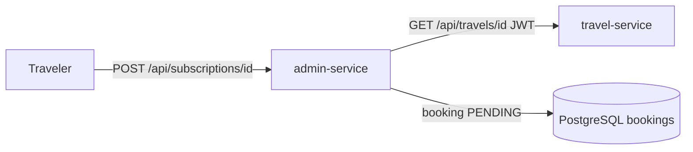

# V2-2 — Souscriptions (subscribe / unsubscribe + cutoff J-3)

Épic **V2-2** de la [roadmap V2](../roadmap-v2.md). Dépend de
[V2-1](v2-1-roles-ownership.md) (rôles + hiérarchie).

> Cet épic est découpé en deux : **V2-2a** (ce document) livre le cycle de vie
> des souscriptions ; **V2-2b** câblera le paiement (booking `PENDING → CONFIRMED`
> au succès du paiement).

## Ce qui a été livré (V2-2a)

Un voyageur peut **souscrire** à un voyage et **se désinscrire** jusqu'à
**3 jours avant le départ**. Une souscription **est** un `booking` (pas de
nouvelle entité).

## Modèle & décision cross-service

- `admin-service` **possède** les souscriptions (il possède déjà `bookings`).
- Au subscribe, il **lit** le voyage via un appel HTTP à `travel-service`
  (`GET /api/travels/{id}`, **JWT du voyageur propagé**) pour récupérer
  `startDate` / `price` / `currency` / `status`.
- La date de départ est **dénormalisée** dans `bookings.travel_start_date`, ce
  qui rend le contrôle du cutoff à l'unsubscribe **entièrement local** (aucun
  appel cross-service à la désinscription).

## Endpoints

| Méthode & chemin | Rôle | Effet |
| --- | --- | --- |
| `POST /api/subscriptions/{travelId}` | `USER` (+ via hiérarchie MANAGER/ADMIN) | crée un booking `PENDING` |
| `POST /api/subscriptions/{travelId}/unsubscribe` | `USER` (+) | passe le booking en `CANCELLED` |

Le voyageur agit toujours sur **sa** souscription : `userId = sub` du JWT.

### Règles & codes de retour

| Situation | Code |
| --- | --- |
| Souscription OK | 200 (`PENDING`) |
| Voyage inexistant | 404 |
| Voyage non `PUBLISHED` | 409 |
| Déjà souscrit (booking actif) | 409 |
| Désinscription OK (≥ 3 jours avant départ) | 200 (`CANCELLED`) |
| Désinscription < 3 jours avant départ | 409 |
| Pas de souscription active | 404 |

## Fichiers

| Fichier | Rôle |
| --- | --- |
| `db/migration/V2__add_booking_travel_start_date.sql` | colonne `travel_start_date` (Postgres) |
| `domain/Booking.java` | champ `travelStartDate` |
| `repository/BookingRepository.java` | `findByUserIdAndTravelRefId` |
| `service/TravelLookup.java` (+ `TravelClient.java`) | lecture du voyage via `RestClient`, mockable |
| `service/SubscriptionService.java` | logique subscribe/unsubscribe + cutoff |
| `api/SubscriptionController.java` | endpoints `/api/subscriptions` |
| `api/dto/SubscriptionResponse.java` | réponse |
| `application.yml` | `travelplan.travel-service.base-url` |
| `frontend/vite.config.ts`, `frontend/nginx.conf` | route gateway `/api/subscriptions` → admin-service |

## Tests

`SubscriptionControllerIntegrationTest` (7 tests, `TravelLookup` **mocké** —
pas d'appel réseau réel) : subscribe nominal, double souscription (409), voyage
non publié (409), voyage inconnu (404), unsubscribe avant cutoff (200),
unsubscribe après cutoff (409), unsubscribe sans souscription (404).

admin-service : **52 tests** verts (45 → +7).

## Limites / suite

- **Paiement (V2-2b)** : le booking reste `PENDING`. Le passage `CONFIRMED`
  sera piloté par le succès de paiement (payment-service + webhook).
- Cohérence cross-store : si `travel-service` est indisponible au subscribe,
  la souscription échoue (pas de file de retry — acceptable à ce stade).
