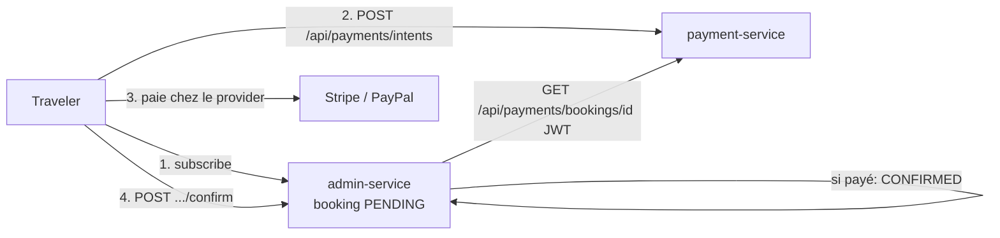

# V2-2b — Paiement de la souscription (confirmation)

Suite de [V2-2a](v2-2-subscriptions.md). Fait passer un booking de `PENDING` à
`CONFIRMED` une fois le paiement réussi.

## Approche : confirmation « pull »

Plutôt qu'un appel service-à-service depuis le webhook (qui imposerait une auth
S2S), la confirmation est **initiée par le client** avec le JWT du voyageur —
symétrique de V2-2a.

1. **subscribe** (V2-2a) → booking `PENDING`.
2. Le voyageur crée un intent de paiement (`POST /api/payments/intents` avec
   `bookingRefId` = id du booking) et paie.
3. **confirm** → admin-service demande à payment-service si le booking est payé ;
   si oui, `PENDING → CONFIRMED`.

## Endpoints

| Méthode & chemin | Service | Rôle | Effet |
| --- | --- | --- | --- |
| `GET /api/payments/bookings/{bookingRefId}` | payment-service | `USER`+ | `{ bookingRefId, paid }` — `paid=true` s'il existe une transaction `SUCCEEDED` |
| `POST /api/subscriptions/{travelId}/confirm` | admin-service | `USER`+ | `PENDING → CONFIRMED` si payé |

### Codes de retour de `confirm`

| Situation | Code |
| --- | --- |
| Payé → confirmé | 200 (`CONFIRMED`) |
| Paiement non abouti | 409 |
| Pas de souscription `PENDING` | 404 |

## Fichiers

**payment-service**
| Fichier | Rôle |
| --- | --- |
| `repository/PaymentTransactionRepository.java` | `findByBookingRefId` |
| `service/PaymentService.java` | `statusForBooking` (`paid` = une tx `SUCCEEDED`) |
| `api/dto/BookingPaymentStatus.java` | réponse `{ bookingRefId, paid }` |
| `api/BookingPaymentController.java` | `GET /api/payments/bookings/{ref}` |

**admin-service**
| Fichier | Rôle |
| --- | --- |
| `service/PaymentLookup.java` (+ `PaymentClient.java`) | interroge payment-service via `RestClient` (JWT propagé), mockable |
| `service/SubscriptionService.java` | méthode `confirm` |
| `api/SubscriptionController.java` | `POST /api/subscriptions/{travelId}/confirm` |
| `application.yml` | `travelplan.payment-service.base-url` |

## Tests

- payment-service : `BookingPaymentControllerIntegrationTest` (4) — payé si tx
  `SUCCEEDED`, non payé si `PENDING`/absente, 401 sans auth. **16 tests** (+4).
- admin-service : `SubscriptionControllerIntegrationTest` (+3, `PaymentLookup`
  mocké) — confirm payé → `CONFIRMED`, non payé → 409, sans booking → 404.
  **55 tests** (+3).

## Limites / suite

- Confirmation **pull** (le client appelle `confirm`) plutôt que **push**
  (webhook → confirmation automatique). Le push nécessiterait une auth
  service-à-service (jeton système) — évolution possible.
- Les providers Stripe/PayPal sont **désactivés par défaut** (`*_ENABLED=false`) ;
  le flux de bout en bout requiert des clés sandbox. La logique de confirmation,
  elle, est testée avec le lookup paiement mocké.
