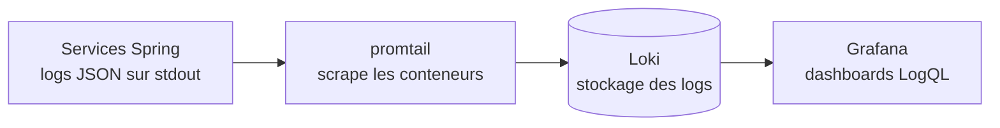
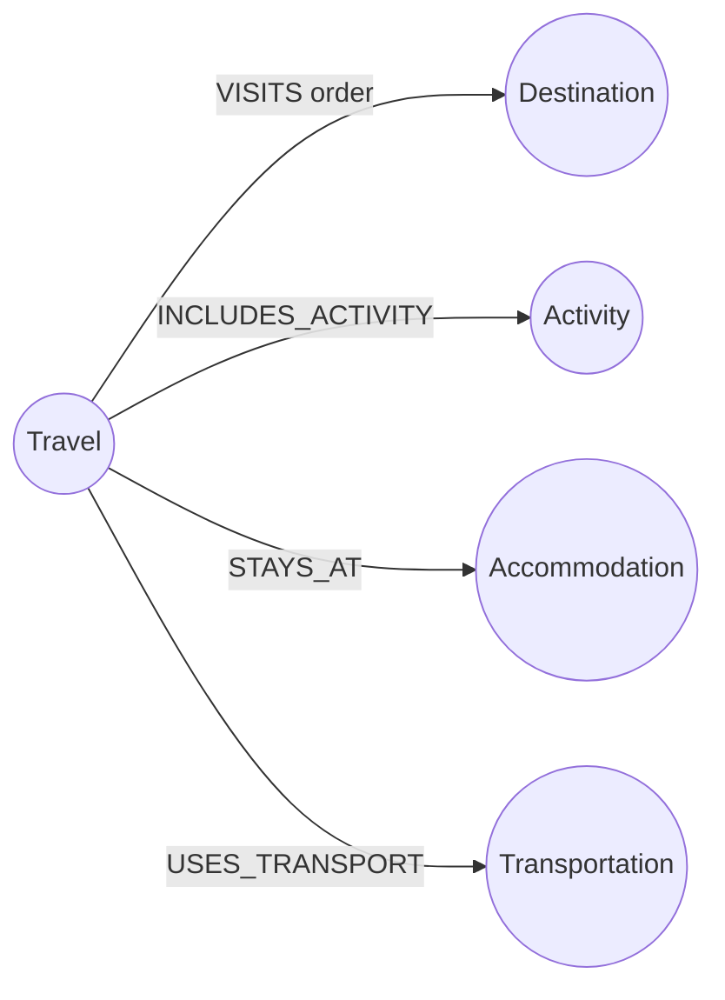

# Jenkinsfile, Grafana & Neo4j — guide d'explication

Fiche de compréhension pour trois briques du projet : la **syntaxe du
`Jenkinsfile`**, l'**observabilité via Grafana** et la **base graphe Neo4j**.
Pour le pipeline CI/CD dans son ensemble voir
[ci-cd-architecture.md](ci-cd-architecture.md) ; pour le schéma de données voir
[database-schema.md](database-schema.md).

## 1. Le `Jenkinsfile` (syntaxe)

Le pipeline est écrit en **Declarative Pipeline** — la forme structurée de
Jenkins (par opposition à la *Scripted Pipeline*, du Groovy libre). Tout est
encapsulé dans un bloc `pipeline { }` avec des directives à des emplacements
fixes, ce qui rend le fichier validable et lisible.

### Squelette

```groovy
pipeline {
  agent any          // OÙ ça tourne : n'importe quel exécuteur Jenkins
  environment { }    // variables partagées par tous les stages
  options { }        // réglages globaux
  triggers { }       // déclenchements automatiques
  stages { }         // la séquence d'étapes (le cœur)
  post { }           // actions après les stages
}
```

### Les directives, dans notre fichier

| Directive | Rôle |
| --- | --- |
| `agent any` | exécute le build sur n'importe quel nœud/exécuteur disponible |
| `environment` | déclare les variables (`MAVEN_IMAGE`, `MAVEN_RUN_ARGS`, …) |
| `credentials('id')` | injecte un credential Jenkins dans une variable **et le masque** dans les logs (`SONAR_HOST_URL`, `SONAR_TOKEN`) |
| `options` | `timestamps()` horodate chaque ligne ; `disableConcurrentBuilds()` interdit deux builds en parallèle |
| `triggers` | `pollSCM('H/2 * * * *')` interroge Git toutes les ~2 min et démarre un build sur nouveau commit |
| `stages` / `stage` | les étapes, exécutées **en séquence** |
| `post { always { } }` | s'exécute à la fin quoi qu'il arrive (ici : publication des rapports JUnit) |

### Un `stage`

```groovy
stage('Checkout') {   // nom affiché dans l'UI
  steps {             // les actions du stage
    checkout scm      // clone le dépôt/branche d'où vient le Jenkinsfile
  }
}
```

Les **steps** utilisés :

- `checkout scm` — checkout automatique du dépôt du job.
- `sh '...'` — exécute une commande shell.
- `script { }` — trappe vers le Groovy (Scripted) à l'intérieur du déclaratif ;
  nécessaire pour `docker.image().inside()`.
- `docker.image(x).inside(args) { }` — plugin **Docker Pipeline** : démarre un
  conteneur depuis l'image `x`, monte le workspace, exécute le bloc dedans
  (`args` = options passées à `docker run`).
- `timeout(time: 10, unit: 'MINUTES') { }` — encadre des steps d'une limite.
- `junit ...` — plugin JUnit : publie les rapports de tests.

### Le cron de `pollSCM`

```
H/2   *      *      *      *
min   heure  jour   mois   jour-semaine
```

`H/2` (champ minutes) = toutes les ~2 minutes. Le `H` (*hash*) répartit la
charge au lieu de taper à la même seconde pour tous les jobs.

### Deux subtilités (bons points à l'oral)

**Guillemets simples vs doubles — sécurité des secrets.**

```groovy
sh '''
  mvn ... -Dsonar.token="${SONAR_TOKEN}"
'''
```

Les `'''...'''` (simples) → **Groovy n'interpole pas**. `${SONAR_TOKEN}` est
passé tel quel au shell, qui l'étend comme variable d'environnement → le secret
**reste masqué**. Avec des `"""..."""` (doubles), Groovy interpolerait la valeur
en clair dans la commande → fuite du secret dans les logs.

**`script { }`.** Le déclaratif est volontairement rigide (validé par Jenkins).
Dès qu'on a besoin de logique Groovy (piloter un conteneur Docker), on ouvre un
îlot de Scripted Pipeline via `script { }`.

## 2. Grafana (observabilité — logs centralisés)

Grafana est l'**interface de visualisation des logs**. Il ne stocke rien
lui-même : il lit dans Loki. La chaîne complète est *promtail → Loki → Grafana*.



### Comment ça marche

1. Chaque service Spring écrit ses logs en **JSON** sur `stdout` (via
   `logstash-logback-encoder`), en incluant un `correlationId` par requête.
2. **promtail** découvre les conteneurs du projet (`docker_sd_configs` filtré
   sur le label `com.docker.compose.project=travelplan`), parse le JSON
   (extrait `level`, `correlationId`, `logger`, `thread`, `message`) et pousse
   le tout vers Loki.
3. **Loki** stocke et indexe les logs par labels (`project`, `service`,
   `level`, `correlationId`).
4. **Grafana** interroge Loki en **LogQL** et affiche les dashboards.

### Configuration réelle

| Élément | Valeur |
| --- | --- |
| Image | `grafana/grafana:11.4.0` |
| Accès | `http://localhost:5440` (port `5440`→`3000`) |
| Réseau | `travel-observability` |
| Login | `admin` / `admin` (`GF_SECURITY_ADMIN_*`), anonyme désactivé |
| Datasource | **Loki** provisionnée (`http://loki:3100`, par défaut, non éditable) |
| Dashboard | **TravelPlan logs** provisionné, panneaux *All services* et *By correlationId* |

Datasource et dashboard sont **provisionnés** (fichiers montés dans
`infra/docker/grafana/provisioning/`) : ils existent dès le premier démarrage,
pas de clic manuel.

### LogQL — exemples

```logql
{project="travelplan"}                          # tous les logs du projet
{project="travelplan", service="auth-service"}  # un seul service
{project="travelplan"} | json | correlationId="<id>"   # une requête tracée
```

Le `correlationId` (propagé via l'en-tête `X-Correlation-Id` et le MDC des logs)
permet de suivre **une même requête à travers plusieurs services** — c'est
l'intérêt principal de la centralisation.

## 3. Neo4j (base de données graphe — travel-service)

Neo4j est une **base orientée graphe** : les données sont des **nœuds** reliés
par des **relations** typées, plutôt que des tables et des jointures. Le
`travel-service` l'utilise pour modéliser les offres de voyage, où les liens
(un voyage visite des destinations, inclut des activités…) sont au cœur du
domaine et où des nœuds sont **partagés** entre plusieurs voyages.

### Configuration réelle

| Élément | Valeur |
| --- | --- |
| Image | `neo4j:5-community` |
| Port `7474` | Neo4j **Browser** (UI web, HTTP) → `http://localhost:7474` |
| Port `7687` | protocole **Bolt** (binaire, utilisé par les drivers) |
| Auth | `NEO4J_AUTH` = `neo4j` / `<mot de passe>` |
| Mémoire | heap initial 512 Mo, max 1 Go |
| Healthcheck | `cypher-shell 'RETURN 1;'` |

Le service s'y connecte via **Spring Data Neo4j** :

```yaml
spring:
  neo4j:
    uri: bolt://neo4j:7687
    authentication: { username: neo4j, password: <secret> }
  data:
    neo4j:
      database: neo4j
```

En production, les identifiants viennent de **Vault** (profil `vault`), pas du
fichier de config.

### Modèle de graphe

Les entités Java annotées `@Node` : `Travel`, `Destination`, `Activity`,
`Accommodation`, `Transportation`.



| Nœud | Propriétés clés |
| --- | --- |
| `Travel` | `id`, `title`, `startDate`, `endDate`, `durationDays`, `price`, `currency`, `status` |
| `Destination` | `id`, `name`, `country`, `latitude`, `longitude` |
| `Activity` | `id`, `name`, `category`, `durationMinutes` |
| `Accommodation` | `id`, `name`, `type`, `address` |
| `Transportation` | `id`, `type`, `provider`, `departureLocation`, `arrivalLocation` |

### Cypher — exemples

```cypher
// Créer un voyage reliant une destination
CREATE (t:Travel {id: $id, title: 'Rome 3 jours'})
CREATE (d:Destination {id: $did, name: 'Rome', country: 'IT'})
CREATE (t)-[:VISITS {order: 1}]->(d);

// Toutes les destinations d'un voyage, dans l'ordre
MATCH (t:Travel {id: $id})-[v:VISITS]->(d:Destination)
RETURN d ORDER BY v.order;

// Tous les voyages qui passent par une destination
MATCH (t:Travel)-[:VISITS]->(:Destination {name: 'Rome'})
RETURN t;

// Supprimer un voyage et SES relations, sans toucher aux nœuds partagés
MATCH (t:Travel {id: $id}) DETACH DELETE t;
```

`DETACH DELETE` supprime le nœud **et** ses relations d'un coup :
`Destination`, `Activity`, etc. peuvent être partagés entre plusieurs `Travel`,
on ne les supprime donc pas.

### Lien avec PostgreSQL

Les `bookings` (Postgres, admin-service) référencent un voyage par
`travel_ref_id` = `Travel.id` (Neo4j, stocké en `String` au format UUID). Pas de
contrainte cross-store : la cohérence est **applicative**. Détails dans
[database-schema.md](database-schema.md).
